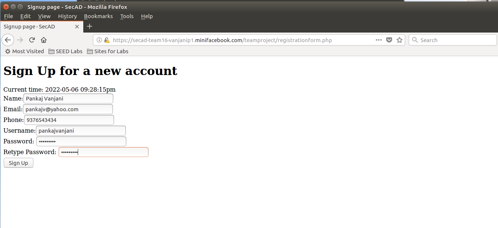
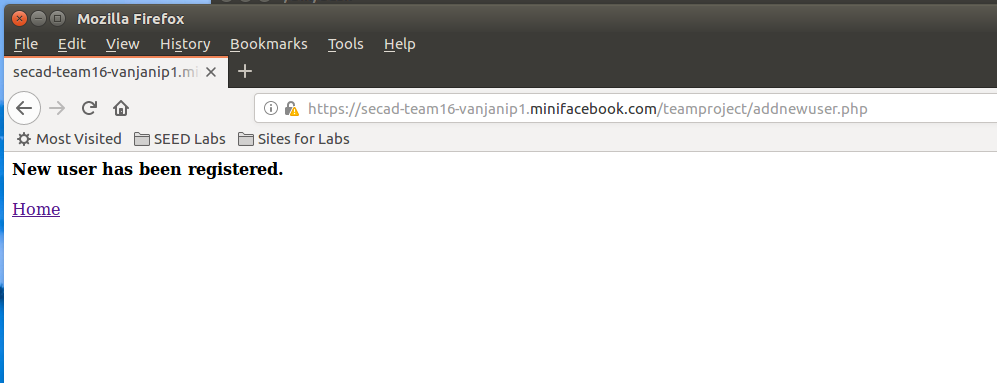
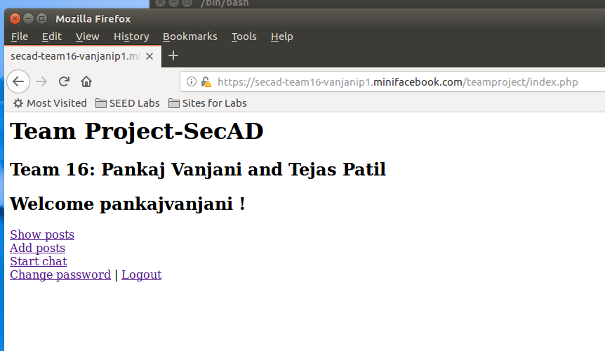
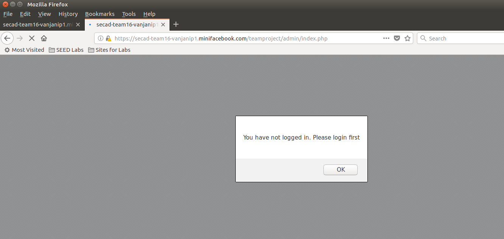
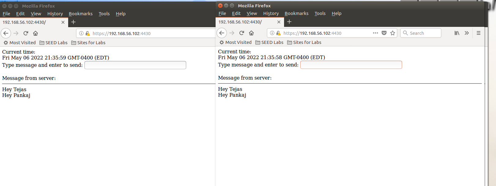

# CPS 475/575 Secure Application Development 

## Team Project

## Member details :

### Name - Pankaj Anil Vanjani

#Video Link : <https://drive.google.com/file/d/1VVa8ujWPczoWV_5tDKzJr7u5YEwBfU-9/view?usp=sharing>

# 1. Introduction

The social networking platforms are emerging nowadays which allow users to connect with each other and share the content throughout the network. Considering the same approach, we are implementing an application known as "miniFacebook" which is the simple form of real Facebook application. Considering the security aspects, we tried to develop a robust and secure web application which not only provides the feature, but provide the users handling the social platform with the maximum security.

# 2. Design

*	For this project, we have used the mysql for the implementation of database. PHP is used to connect the database with the web server. The database store parameters such as users, comments, posts, and superusers.

*   For the best visual experience from users point of view, the frontend is designed mainly by using HTML5, CSS, and Javascript.

*   In this simple social networking application, there are two kinds of users. Super users have all the access to view, delete as well as enable the regular users. However, the regular users can just chat and interact with the other regular users across the social network.

# 3. Implementation & security analysis

*   This project has been developed by considering all the major security flaws that makes the program vulnerable to the attackers. Firstly, Hypertext Transfer Protocol Secure is used for the deployment which ensures the encrypted communication of data. Moreover, all the SQL queries are in prepared statement which saves the program from SQL injection attacks. All the HTML outputs are sanitized and validated. Since, there are two types of users, role-based access control mechanism is used to provide the access of the services to certain users.

*   The project has majority of security requirements that defense-in-depth principle have. Since the webpage works on the HTTPS, the session cookies has been secured. In addition, the javascript code is disabled that makes hard for attacker to read and write session cookies. Also all the inputs such as username, password, etc. has been validated to keep them safe from various SQL attacks.

*   The database is most vulnerable part where attacks can happen. To secure the data, SQL prepared statements are used which prevent the data from malicious inputs. SQL injection attack can be prevented by this mechanism. Furthermore, the database passwords are hashed, so that there wont be any transperent data viewed by the attackers. For the super users, the new column is used. This method will prevent the normal users gaining the priviledges that super users have. In PHP code, there is no mysql root account is used. Since, the root account has all the control over the database.

*   The code is rubust since in every layer, the input validation is done. For instance, in registration page, the regular expressions are used for syntactical checking. It ensures that the users put the input within the specific range of characters.

*   The code is vulnerable to the attacks such as Cross Site Scripting (XSS), SQL Injection, CSRF, and Session Hijacking. With XSS, the inputs are validated and sanitized.  Whereas, the SQL injection attacks can be prevented by using SQL prepared statements. The Cross Site Request Forgery attacks can be prevented by token based authentication. A secret token is generated to authenticate the users in CSRF. And, the session hijacking attack is prevented by hiding the cookie information. Session ID is hidden from users. Also the javascript code is hidden to prevent the insertion of cookie information externally.

*   The super users and regular users are separated by creating new table for super users. Now, these users will only have the access to the privileges assigned to them. 


# 4. Demo (screenshots)


*   Everyone can register a new account and then login




*   A regular logged-in user cannot access the link for superusers

*   A logged-in user can have a real-time chat with other logged-in users


# Appendix

1. database.sql

```
/*DROP TABLE IF EXISTS `users`;

CREATE TABLE users(
	username varchar(50) PRIMARY KEY,
	password varchar(100) NOT NULL);

LOCK TABLES `users` WRITE;
INSERT INTO `users` VALUES ('admin',password('trap3011'));
UNLOCK TABLES;*/

DROP TABLE IF EXISTS `posts`;

CREATE TABLE `posts` (
	postid int(50) PRIMARY KEY,
	title varchar(200) NOT NULL,
	content varchar(1000) NOT NULL,
	date datetime NOT NULL,
	`owner` varchar(50) NOT NULL,
	FOREIGN KEY(`owner`) REFERENCES `users`(`username`) ON DELETE CASCADE);

```

2. src/addnewuser.php

```
<?php

	require "database.php";
	$username=sanitize_input($_POST["username"]);
	$password=sanitize_input($_POST["password"]);
	$name=sanitize_input($_POST["name"]);
	$email=sanitize_input($_POST["email"]);
	$phone=sanitize_input($_POST["phone"]);
	if(isset($username) AND isset($password) AND isset($name) AND isset($email) AND isset($phone)){
		//echo "DEBUG:addnewuser.php->Got: username=$username;password=$password;name=$name;email=$email;phone=$phone\n";
		if(addnewuser($username,$password,$name,$email,$phone)){
			echo "<h4>New user has been registered.</h4>";
		}else{
			echo "<h4>Error: Cannot register the user.</h4>";
		}	
	}else{
		echo "Please complete the form to register.";
	}
?>
<a href="form.php">Home</a> 

```
3. src/addpost.php

```
<?php
	require "session_auth.php";
	require "database.php";
	$username=$_SESSION["username"];
	$title=$_REQUEST["title"];
	//$date=date("mm/dd/YYYY");
	$content=$_REQUEST["content"];
	//$newpassword=$_REQUEST["newpassword"];
	$nocsrftoken=$_POST["nocsrftoken"];
	if(!isset($nocsrftoken) or ($nocsrftoken!=$_SESSION['nocsrftoken'])){
		echo "<script>alert('Cross-site request forgery is detected!');</script>";
		header("Refresh:0; url=logout.php");
		die();
	}
	if(isset($title) AND isset($content)){
		//echo "DEBUG:changepassword.php->Got: username=$username;newpassword=$newpassword\n";
		if(addposts($title,$content,$username)){
			echo "<h4>New post has been added.</h4>";
		}else{
			echo "<h4>Error: Cannot add the post.</h4>";
		}	
	}else{
		echo "No provided content to add.";
	}
?>
<a href="index.php">Home</a> | <a href="logout.php">Logout</a>
```
4. src/addpostform.php

```
<?php
require 'session_auth.php';
$rand = bin2hex(openssl_random_pseudo_bytes(16));
$_SESSION["nocsrftoken"] = $rand;
?>
<form action="addpost.php" method="post"> 
<div>
 
<p>Title:  <input type="text" name="title" placeholder="Name"></p>
Content:  <br><textarea name="content" required cols="50" rows="9" ></textarea>
   <br>
<p>  <button class="button" type="submit">submit new post
</button> </p>

</div>
<input type="hidden" name="nocsrftoken" value="<?php echo $rand; ?>" />

</form>
<a href="index.php">Home></a>
```

5. src/changepassword.php

```
<?php
	require "session_auth.php";
	require "database.php";
	$username=$_SESSION["username"];
	$newpassword=$_REQUEST["newpassword"];
	$nocsrftoken=$_POST["nocsrftoken"];
	if(!isset($nocsrftoken) or ($nocsrftoken!=$_SESSION['nocsrftoken'])){
		echo "<script>alert('Cross-site request forgery is detected!');</script>";
		header("Refresh:0; url=logout.php");
		die();
	}
	if(isset($username) AND isset($newpassword)){
		//echo "DEBUG:changepassword.php->Got: username=$username;newpassword=$newpassword\n";
		if(changepassword($username,$newpassword)){
			echo "<h4>New password has been set.</h4>";
		}else{
			echo "<h4>Error: Cannot change the password.</h4>";
		}	
	}else{
		echo "No provided username/password to change.";
	}
?>
<a href="index.php">Home</a> | <a href="logout.php">Logout</a
```

6. src/changepasswordform.php

```
<?php
	require "session_auth.php";
  $rand=bin2hex(openssl_random_pseudo_bytes(16));
  $_SESSION["nocsrftoken"]=$rand;
?>
<!DOCTYPE html>
<html lang="en">
<head>
  <meta charset="utf-8">
  <title>Login page - SecAD</title>
</head>
<body>
      	<h1>Change Password-SecAD</h1>
        <h2>By Phu Phung</h2>
        

<?php
  //some code here
  echo "Current time: " . date("Y-m-d h:i:sa")
?>
          <form action="changepassword.php" method="POST" class="form login">
                Username:<!--input type="text" class="text_field" name="username" /--> 
                <?php echo htmlentities($_SESSION["username"]); ?>
                <br>
                <input type="hidden" name="nocsrftoken" value="<?php echo $rand; ?>" />
                New Password: <input type="password" class="text_field" name="newpassword" /> <br>
                <button class="button" type="submit">
                  Change Password
                </button>
          </form>

</body>
</html>
```

7. src/database.php

```
<?php
	
	$mysqli = new mysqli('localhost',
							'ptuser' /*Database username*/,
							'pankajtejas' /*Database password*/,
							'secadteam16' /*Database name*/);
		if($mysqli->connect_errno){
			printf("Database connection failed: %s\n", $mysqli->connect_error);
			exit();
		}    
	
				
	
  	function changepassword($username, $newpassword) {
  		global $mysqli;
		$prepared_sql="UPDATE users SET password=password(?) WHERE  username= ?;";
		//echo "DEBUG>prepared_sql=$prepared_sql\n";
		if(!$stmt = $mysqli->prepare($prepared_sql)) return FALSE;
		$stmt->bind_param("ss",$newpassword,$username);
		if(!$stmt->execute()) return FALSE;
		return TRUE;
  	}

  	function addnewuser($username, $password, $name, $email, $phone) {
  		global $mysqli;
		$prepared_sql="INSERT INTO users VALUES(?,password(?),?,?,?);";
		//echo "DEBUG>prepared_sql=$prepared_sql\n";
		if(!$stmt = $mysqli->prepare($prepared_sql)) return FALSE;
		$stmt->bind_param("sssss",$username,$password,$name,$email,$phone);
		if(!$stmt->execute()) return FALSE;
		return TRUE;
  	}

  	function sanitize_input($input) {
 		$input = trim($input);
 		$input = stripslashes($input);
 		$input = htmlspecialchars($input);
 		return $input;
	}

	function addposts($title,$content,$owner){
		global $mysqli;
		$prepared_sql="INSERT INTO posts VALUES(DEFAULT,?,?,NOW(),?);";
		//echo "DEBUG>prepared_sql=$prepared_sql\n";
		if(!$stmt = $mysqli->prepare($prepared_sql)) return FALSE;
		$stmt->bind_param("sss",$title,$content,$owner);
		if(!$stmt->execute()) return FALSE;
		return TRUE;
	}

	function displayposts(){
		global $mysqli;
		$prepared_sql = "SELECT title, content, date FROM posts;";
		if(!$stmt = $mysqli->prepare($prepared_sql)) return FALSE;
		if(!$stmt->execute()) return FALSE;
		$title = NULL; $content = NULL; $date=NULL;
		if(!$stmt->bind_result($title, $content, $date)) echo "Binding failed ";
		while($stmt->fetch()){
			echo htmlentities($title) . ", " . htmlentities($content) . ", " .
 			htmlentities($date) . "<br>";}
	}

?>
```

8. src/form.php

```
<!DOCTYPE html>
<html lang="en">
<head>
  <meta charset="utf-8">
  <title>Login page - SecAD</title>
</head>
<body>
      	<h1>Team Project-SecAD</h1>
        <h2>Team 16: Pankaj Vanjani and Tejas Patil</h2>
        

<?php
  //some code here
  echo "Current time: " . date("Y-m-d h:i:sa")
?>
          <form action="index.php" method="POST" class="form login">
                Username:<input type="text" class="text_field" name="username" /> <br>
                Password: <input type="password" class="text_field" name="password" /> <br>
                <button class="button" type="submit">
                  Login
                </button>
          </form>
          <br>
          <a href="/teamproject/admin/form.php"> Are you an admin?</a> <br>
          <a href="registrationform.php"> New User? Sign Up </a>

</body>
</html>

```

9. src/index.php

```
<?php
	/*$lifetime=15*60;
	$path="/";
	$domain="*.miniFacebook.com";
	$secure=TRUE;
	$httponly=TRUE;
	session_set_cookie_params($lifetime,$path,$domain,$secure,$httponly);*/
	session_start();
	//require "session_auth.php";
	$mysqli = new mysqli('localhost',
							'ptuser' /*Database username*/,
							'pankajtejas' /*Database password*/,
							'secadteam16' /*Database name*/);
		if($mysqli->connect_errno){
			printf("Database connection failed: %s\n", $mysqli->connect_error);
			exit();
		}    
	
		if (isset($_POST["username"]) and isset($_POST["password"]) ){
	if (securechecklogin($_POST["username"],$_POST["password"])) {
		$_SESSION["logged"]=TRUE;
		$_SESSION["username"]=$_POST["username"];
		$_SESSION["browser"]=$_SERVER["HTTP_USER_AGENT"];
		
	}else{
		echo "<script>alert('Invalid username/password');</script>";
		session_destroy();
		header("Refresh:0; url=form.php");
		die();
	}
}

if(!isset($_SESSION["logged"]) or $_SESSION["logged"] != TRUE) {
	echo "<script>alert('You have not logged in. Please login first');</script>";
	header("Refresh:0; url=form.php");
		die();
	}
if($_SESSION["browser"]!=$_SERVER["HTTP_USER_AGENT"]){
	echo "<script>alert('Session Hijacking is detected!');</script>";
		header("Refresh:0; url=form.php");
		die();

}

?>
	<h1>Team Project-SecAD</h1>
        <h2>Team 16: Pankaj Vanjani and Tejas Patil</h2>
	<h2> Welcome <?php echo htmlentities($_SESSION['username']); ?> !</h2>
	<a href="showposts.php"> Show posts </a> <br>
	<a href="addpostform.php"> Add posts </a> <br>
	<a href="https://192.168.56.102:4430/"> Start chat </a> <br>
	<a href="changepasswordform.php">Change password</a> |
	<a href="logout.php">Logout</a>
<?php		
	
  	function securechecklogin($username, $password) {
  		global $mysqli;
		$prepared_sql="SELECT * FROM users WHERE  username= ? AND password=password(?);";
		if(!$stmt = $mysqli->prepare($prepared_sql))
			echo "Prepared Statement Error";
		$stmt->bind_param("ss",$username,$password);
		if(!$stmt->execute()) echo "Execute Error";
		if(!$stmt->store_result()) echo "Store_result Error";
		$result=$stmt;
		if($result->num_rows==1)
			return TRUE;
		return FALSE;
  	}
?>
```

10. src/logout.php

```
<?php
session_start();
session_destroy();
?>
<p> You are logged out </p>

<a href="form.php"> Login Again </a> 
```

12. src/registrationform.php

```
<!DOCTYPE html>
<html lang="en">
<head>
  <meta charset="utf-8">
  <title>Signup page - SecAD</title>
</head>
<body>
      	<h1>Sign Up for a new account</h1>
        
        

<?php
  //some code here
  echo "Current time: " . date("Y-m-d h:i:sa")
?>
          <form action="addnewuser.php" method="POST" class="form login">
          		Name:<input type="text" class="text_field" name="name" placeholder="Enter your name" required /> <br>
          		Email:<input type="email" class="text_field" name="email" placeholder="Enter your email" required 
              pattern="^[\w.-]+@[\w-]+(.[\w-]+)*$"
        title="Please enter a valid email"
        placeholder="Your email address"
        onchange="this.setCustomValidity(this.validity.patternMismatch?this.title: '');" /> <br>
          		Phone:<input type="tel" class="text_field" name="phone" placeholder="Enter your phone number" required /> <br>
                Username:<input type="text" class="text_field" name="username" placeholder="Enter your username" required/>
				 <br>
                Password: <input type="password" class="text_field" name="password" required
 pattern="^(?=.*[a-z])(?=.*[A-Z])(?=.*[0-9])(?=.*[!@#$%^&])[\w!@#$%^&]{8,}$"
 placeholder="Your password"
 title="Password must have at least 8 characters with 1 special symbol !@#$%^& 1 number,
1 lowercase, and 1 UPPERCASE"
 onchange="this.setCustomValidity(this.validity.patternMismatch?this.title: '');
form.repassword.pattern = this.value;" /> <br>
Retype Password: <input type="password" class="text_field" name="repassword"
 placeholder="Retype your password" required
 title="Password does not match"
 onchange="this.setCustomValidity(this.validity.patternMismatch?this.title: '');"/> <br>
                <button class="button" type="submit">
                  Sign Up
                </button>
          </form>

</body>
</html>

```

13. src/session_auth.php

```
<?php
	$lifetime=15*60;
	$path="/";
	$domain="*.miniFacebook.com";
	$secure=TRUE;
	$httponly=TRUE;
	session_set_cookie_params($lifetime,$path,$domain,$secure,$httponly);
	session_start();

	if(!isset($_SESSION["logged"]) or $_SESSION["logged"] != TRUE) {
	echo "<script>alert('You have not logged in. Please login first');</script>";
	session_destroy();
	header("Refresh:0; url=form.php");
		die();
	}
if($_SESSION["browser"]!=$_SERVER["HTTP_USER_AGENT"]){
	echo "<script>alert('Session Hijacking is detected!');</script>";
	session_destroy();
		header("Refresh:0; url=form.php");
		die();

}
?>
```

14. src/sessiontest.php

```
<?php
session_start(); 
if(isset($_SESSION['views']))
    $_SESSION['views'] = $_SESSION['views']+ 1;
else{
    $_SESSION['views'] = 1;
}
echo "You have visited this page " . $_SESSION['views'] . " times"; 
?>
```

15. src/showposts.php

```
<?php
	//require "session_auth.php";
	require "database.php";
	displayposts();
?>
```

16. admin/database.php

```
<?php
	
	$mysqli = new mysqli('localhost',
							'ptuser' /*Database username*/,
							'pankajtejas' /*Database password*/,
							'secadteam16' /*Database name*/);
		if($mysqli->connect_errno){
			printf("Database connection failed: %s\n", $mysqli->connect_error);
			exit();
		}    
	
				
	
  	function changepassword($username, $newpassword) {
  		global $mysqli;
		$prepared_sql="UPDATE users SET password=password(?) WHERE  username= ?;";
		echo "DEBUG>prepared_sql=$prepared_sql\n";
		if(!$stmt = $mysqli->prepare($prepared_sql)) return FALSE;
		$stmt->bind_param("ss",$newpassword,$username);
		if(!$stmt->execute()) return FALSE;
		return TRUE;
  	}

  	function addnewuser($username, $password, $name, $email, $phone) {
  		global $mysqli;
		$prepared_sql="INSERT INTO users VALUES(?,password(?),?,?,?);";
		echo "DEBUG>prepared_sql=$prepared_sql\n";
		if(!$stmt = $mysqli->prepare($prepared_sql)) return FALSE;
		$stmt->bind_param("sssss",$username,$password,$name,$email,$phone);
		if(!$stmt->execute()) return FALSE;
		return TRUE;
  	}

  	function sanitize_input($input) {
 		$input = trim($input);
 		$input = stripslashes($input);
 		$input = htmlspecialchars($input);
 		return $input;
	}

	function addposts($title,$content,$owner){
		global $mysqli;
		$prepared_sql="INSERT INTO posts VALUES(DEFAULT,?,?,NOW(),?);";
		echo "DEBUG>prepared_sql=$prepared_sql\n";
		if(!$stmt = $mysqli->prepare($prepared_sql)) return FALSE;
		$stmt->bind_param("sss",$title,$content,$owner);
		if(!$stmt->execute()) return FALSE;
		return TRUE;
	}

	function displayposts(){
		global $mysqli;
		$prepared_sql = "SELECT title, content, date FROM posts;";
		if(!$stmt = $mysqli->prepare($prepared_sql)) return FALSE;
		if(!$stmt->execute()) return FALSE;
		$title = NULL; $content = NULL; $date=NULL;
		if(!$stmt->bind_result($title, $content, $date)) echo "Binding failed ";
		while($stmt->fetch()){
			echo htmlentities($title) . ", " . htmlentities($content) . ", " .
 			htmlentities($date) . "<br>";}
	}

?>
```

17. admin/form.php

```
<!DOCTYPE html>
<html lang="en">
<head>
  <meta charset="utf-8">
  <title>Admin Login - SecAD</title>
</head>
<body>
      	<h1>Team Project-SecAD</h1>
        <h2>Team 16: Pankaj Vanjani and Tejas Patil</h2>
        <h3>Admin Login<h3>
        

<?php
  //some code here
  echo "Current time: " . date("Y-m-d h:i:sa")
?>
          <form action="index.php" method="POST" class="form login">
                Username:<input type="text" class="text_field" name="username" /> <br>
                Password: <input type="password" class="text_field" name="password" /> <br>
                <button class="button" type="submit">
                  Login
                </button>
          </form>
          <br>
          
          

</body>
</html>

```

18. admin/index.php

```
<?php
	
	session_start();
	//require "session_auth.php";
	$mysqli = new mysqli('localhost',
							'ptuser' /*Database username*/,
							'pankajtejas' /*Database password*/,
							'secadteam16' /*Database name*/);
		if($mysqli->connect_errno){
			printf("Database connection failed: %s\n", $mysqli->connect_error);
			exit();
		}    
	
		if (isset($_POST["username"]) and isset($_POST["password"]) ){
	if (securechecklogin($_POST["username"],$_POST["password"])) {
		$_SESSION["loggedsuper"]=TRUE;
		$_SESSION["username"]=$_POST["username"];
		$_SESSION["browser"]=$_SERVER["HTTP_USER_AGENT"];
		
	}else{
		echo "<script>alert('Invalid username/password');</script>";
		session_destroy();
		header("Refresh:0; url=form.php");
		die();
	}
}

if(!isset($_SESSION["loggedsuper"]) or $_SESSION["loggedsuper"] != TRUE) {
	echo "<script>alert('You have not logged in. Please login first');</script>";
	header("Refresh:0; url=form.php");
		die();
	}
	
if($_SESSION["browser"]!=$_SERVER["HTTP_USER_AGENT"]){
	echo "<script>alert('Session Hijacking is detected!');</script>";
		header("Refresh:0; url=form.php");
		die();

}

?>
	<h1>Team Project-SecAD</h1>
        <h2>Admin Login</h2>
	<h2> Welcome <?php echo htmlentities($_SESSION['username']); ?> !</h2>
	<a href="table.php"> Show registered users </a> <br>
	 |
	<a href="logout.php">Logout</a>
<?php		
	
  	function securechecklogin($username, $password) {
  		global $mysqli;
		$prepared_sql="SELECT * FROM superusers WHERE  username= ? AND password=password(?);";
		if(!$stmt = $mysqli->prepare($prepared_sql))
			echo "Prepared Statement Error";
		$stmt->bind_param("ss",$username,$password);
		if(!$stmt->execute()) echo "Execute Error";
		if(!$stmt->store_result()) echo "Store_result Error";
		$result=$stmt;
		if($result->num_rows==1)
			return TRUE;
		return FALSE;
  	}
?>
```

19. admin/logout.php

```
<?php
session_start();
session_destroy();
?>
<p> You are logged out </p>

<a href="form.php"> Login Again </a> 
```

20. admin/session_auth.php

```
<?php
	$lifetime=15*60;
	$path="/";
	$domain="*.miniFacebook.com";
	$secure=TRUE;
	$httponly=TRUE;
	session_set_cookie_params($lifetime,$path,$domain,$secure,$httponly);
	session_start();

	if(!isset($_SESSION["loggedsuper"]) or $_SESSION["loggedsuper"] != TRUE) {
	echo "<script>alert('You have not logged in. Please login first');</script>";
	session_destroy();
	header("Refresh:0; url=form.php");
		die();
	}
if($_SESSION["browser"]!=$_SERVER["HTTP_USER_AGENT"]){
	echo "<script>alert('Session Hijacking is detected!');</script>";
	session_destroy();
		header("Refresh:0; url=form.php");
		die();

}
?>
```

21. table.php

```
<?php
include('database.php');
require "session_auth.php";
$query = "SELECT username, Name, Email, phone FROM users";
$result = mysqli_query($mysqli, $query);
?>
<table border ="1" cellspacing="0" cellpadding="10">
  <tr>
    <th>SR No.</th>
    <th>Username</th>
    <th>Name</th>
    <th>Email</th>
    <th>Mobile No</th>
    
  </tr>
<?php
if (mysqli_num_rows($result) > 0) {
  $sn=1;
  while($data = mysqli_fetch_assoc($result)) {
 ?>
 <tr>
   <td><?php echo $sn; ?> </td>
   <td><?php echo $data['username']; ?> </td>
   <td><?php echo $data['Name']; ?> </td>
   <td><?php echo $data['Email']; ?> </td>
   <td><?php echo $data['phone']; ?> </td>
 <tr>
 <?php
  $sn++;}} else { ?>
    <tr>
     <td colspan="7">No data found</td>
    </tr>
 <?php } ?>
 </table>
```
